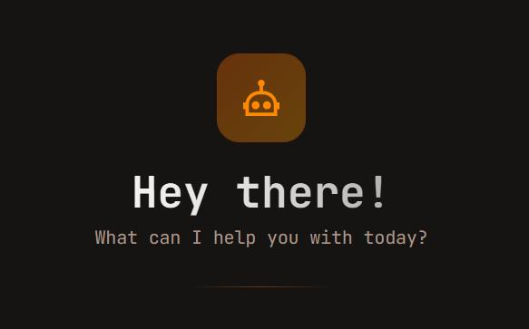
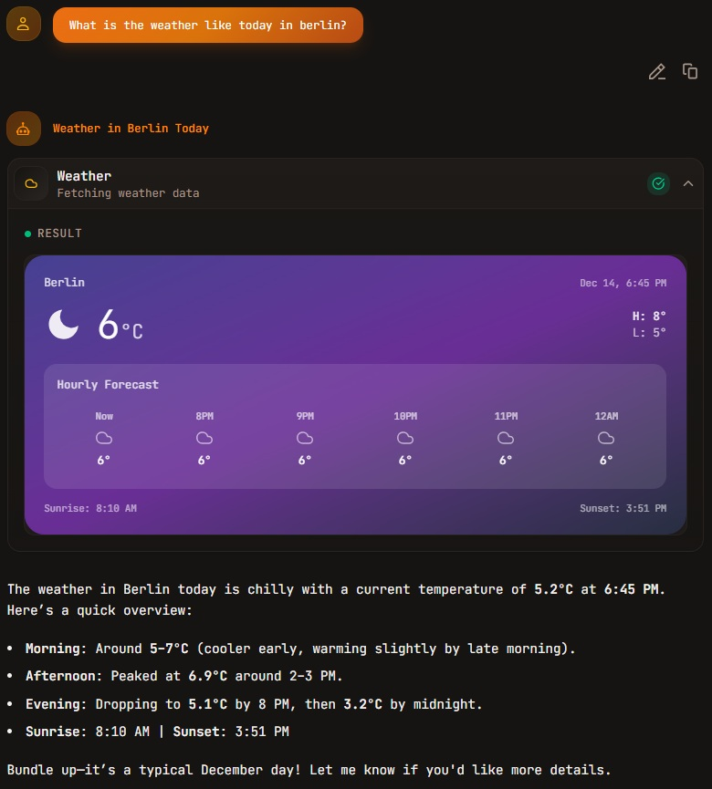
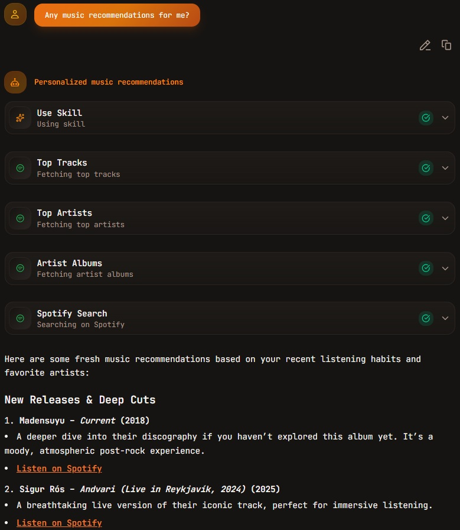
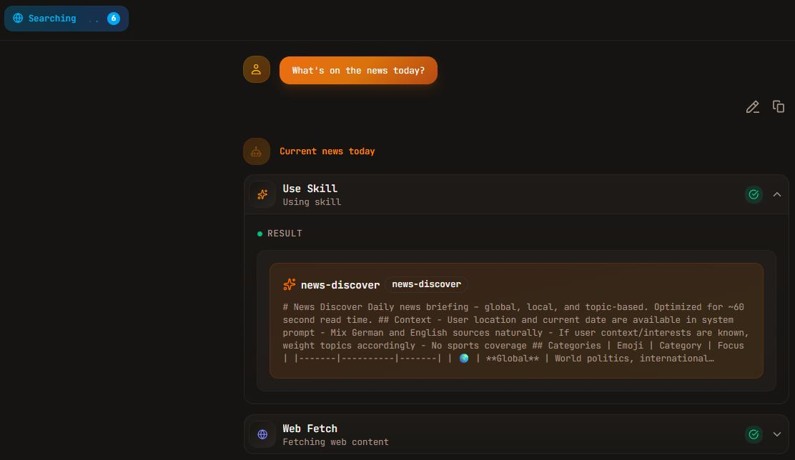

<div align="center">
  
  <h1>✨ Daily Pulse ✨</h1>
  <p><em>Your personal AI assistant for daily tasks, music, research and creative work</em></p>
  
  [](LICENSE)
  [](https://nextjs.org)
  [](https://react.dev)
  [](https://typescriptlang.org)
  [](https://playwright.dev)

  <br>

### 🌤️ Smart Weather Insights

  

### 🎵 AI-Powered Music Discovery

  

### And more...

  
</div>

---

## 💡 Key Highlights

- 🎯 **Full-Stack Development** – End-to-end implementation from UI to database
- 🔄 **API Integration Mastery** – OAuth flows, token refresh, error handling for Spotify & Google APIs
- 🧪 **Quality Assurance** – E2E testing with Playwright
- 📊 **Modern Tooling** – TypeScript, Biome linter, Drizzle ORM, Docker Compose
- 🚀 **Production-Ready** – Deployed on Vercel with proper environment management
- 🤖 **AI-Powered** – Multi-model support via OpenRouter (Claude, GPT, Mistral, etc.)

---

## 🌟 Features

### 🤖 AI-Powered Chat

- **Vercel AI SDK Framework** – Built on Vercel AI SDK with OpenRouter provider for multi-model access
- **Multiple LLM Models** – Claude (Opus, Sonnet, Haiku), GPT-5, Mistral and others via [OpenRouter](https://openrouter.ai/)
- **Smart Tools** – Weather forecasts, web search and integrations with Spotify, Google and more
- **Skills System** – Specialized capabilities for context handovers, news research, music discovery and more

### 🎵 Spotify Integration

- **Now Playing** – Real-time header indicator with playback controls
- **Music Management** – Search tracks, manage playlists, view listening history
- **Smart Recommendations** – Personalized suggestions based on your taste
- [📖 Full Spotify Documentation](docs/SPOTIFY_INTEGRATION.md)

### 📅 Google Integration

- **Calendar Management** – View, create, update, and delete events
- **Gmail** – Read and manage messages and labels
- **Google Tasks** – Manage task lists, tasks, and subtasks
- [📖 Full Google Documentation](docs/GOOGLE_INTEGRATION.md)

### 📝 Artifacts (Beta)

Create and edit interactive content directly in chat:

- **Text Documents** – Rich markdown editing with live preview
- **Code Snippets** – Syntax-highlighted code with multiple language support
- **Spreadsheets** – Interactive data grids for analysis

### 🔐 Authentication & Storage

- **Secure Auth** – Email/password authentication via Auth.js
- **Persistent Storage** – PostgreSQL for chat history, Redis for caching
- **File Uploads** – Vercel Blob integration for attachments

### 📱 Modern Experience

- **Progressive Web App** – Install as a native app on any device
- **Responsive Design** – Beautiful UI built with Tailwind CSS and shadcn/ui
- **Dark Mode** – System-aware theming for comfortable viewing

---

## 🏗️ Architecture

```
┌─────────────────────┐
│   Next.js Frontend  │ ← App Router, React 19, Server Components
│   (Tailwind CSS +   │ ← shadcn/ui, Responsive Design
│    shadcn/ui)       │
└──────────┬──────────┘
           │
┌──────────▼──────────┐
│    API Layer        │ ← Route Handlers, Middleware
│  (Next.js Routes)   │
└──────────┬──────────┘
           │
┌──────────▼──────────────────────┐
│     Service Layer               │
├─────────────────────────────────┤
│ • Vercel AI SDK                 │
│ • OpenRouter Provider           │
│ • Spotify API Client (OAuth)    │
│ • Google APIs Client (OAuth)    │
│ • Auth.js (NextAuth v5)         │
│ • Vercel Blob Storage           │
└──────────┬──────────────────────┘
           │
┌──────────▼──────────┐
│  Data Persistence   │
├─────────────────────┤
│ • PostgreSQL        │ ← Chat history, User data
│   (Drizzle ORM)     │
│ • Redis Cache       │ ← Session management
│   (Vercel KV)       │
└─────────────────────┘
```

## 🛠️ Tech Stack

<table>
  <tr>
    <td><strong>Framework</strong></td>
    <td>Next.js 16 (App Router, React 19, Server Components)</td>
  </tr>
  <tr>
    <td><strong>Language</strong></td>
    <td>TypeScript 5.3</td>
  </tr>
  <tr>
    <td><strong>AI</strong></td>
    <td>Vercel AI SDK + OpenRouter</td>
  </tr>
  <tr>
    <td><strong>Database</strong></td>
    <td>PostgreSQL with Drizzle ORM</td>
  </tr>
  <tr>
    <td><strong>Cache</strong></td>
    <td>Redis (Vercel KV)</td>
  </tr>
  <tr>
    <td><strong>Styling</strong></td>
    <td>Tailwind CSS + shadcn/ui components</td>
  </tr>
  <tr>
    <td><strong>Auth</strong></td>
    <td>Auth.js (NextAuth v5)</td>
  </tr>
  <tr>
    <td><strong>Storage</strong></td>
    <td>Vercel Blob</td>
  </tr>
  <tr>
    <td><strong>Testing</strong></td>
    <td>Playwright (E2E)</td>
  </tr>
  <tr>
    <td><strong>Linting</strong></td>
    <td>Biome</td>
  </tr>
  <tr>
    <td><strong>Package Manager</strong></td>
    <td>pnpm</td>
  </tr>
  <tr>
    <td><strong>Deployment</strong></td>
    <td>Vercel (with Edge Functions)</td>
  </tr>
</table>

---

## 🚀 Quick Start

### Prerequisites

- Node.js 18+ and pnpm
- PostgreSQL database (recommended: [Vercel Postgres](https://vercel.com/storage/postgres))
- Redis instance (recommended: [Vercel KV](https://vercel.com/storage/kv))

### Installation

1. **Clone and install dependencies**

   ```bash
   git clone https://github.com/aikdeirel/vercel-nextjs-ai-chatbot.git
   cd vercel-nextjs-ai-chatbot
   pnpm install
   ```

2. **Configure environment variables**

   Copy `.env.example` to `.env.local` and fill in your credentials:

   ```bash
   cp .env.example .env.local
   ```

   **Required variables:**

   - `AUTH_SECRET` – Authentication secret (generate with `openssl rand -base64 32`)
   - `POSTGRES_URL` – PostgreSQL connection string
   - `REDIS_URL` – Redis connection string
   - `OPENROUTER_API_KEY` – OpenRouter API key for LLM access ([get yours here](https://openrouter.ai/keys))
   - `BLOB_READ_WRITE_TOKEN` – Vercel Blob storage token ([setup guide](docs/BLOB_STORAGE_SETUP.md))

   **Optional (for Spotify features):**

   - `SPOTIFY_CLIENT_ID`
   - `SPOTIFY_CLIENT_SECRET`
   - `SPOTIFY_REDIRECT_URI`

   **Optional (for Google features):**

   - `GOOGLE_CLIENT_ID`
   - `GOOGLE_CLIENT_SECRET`
   - `GOOGLE_REDIRECT_URI`

3. **Set up the database**

   ```bash
   pnpm db:migrate
   ```

4. **Start the development server**

   ```bash
   pnpm dev
   ```

Visit [http://localhost:3000](http://localhost:3000) to start chatting! 🎉

---

## 📦 Available Scripts

```bash
pnpm dev          # Start development server with Turbopack
pnpm build        # Build for production
pnpm start        # Start production server
pnpm lint         # Run Biome linter
pnpm format       # Format code with Biome
pnpm test         # Run Playwright E2E tests
pnpm db:migrate   # Apply database migrations
pnpm db:studio    # Open Drizzle Studio
```

---

## 🚢 Deployment

### Deploy to Vercel

The easiest way to deploy your own version is using the Vercel Platform:

[](https://vercel.com/new/clone?repository-url=https://github.com/aikdeirel/vercel-nextjs-ai-chatbot)

**After clicking the button above:**

1. **Connect your GitHub account** and create a new repository
2. **Configure Environment Variables** in Vercel dashboard:

   **Required:**

   - `AUTH_SECRET` – Generate with `openssl rand -base64 32`
   - `POSTGRES_URL` – Use [Vercel Postgres](https://vercel.com/storage/postgres) (free tier available)
   - `REDIS_URL` – Use [Vercel KV](https://vercel.com/storage/kv) (free tier available)
   - `OPENROUTER_API_KEY` – Get yours at [OpenRouter](https://openrouter.ai/keys)
   - `BLOB_READ_WRITE_TOKEN` – Create in Vercel Blob storage ([setup guide](docs/BLOB_STORAGE_SETUP.md))

   **Optional (for integrations):**

   - Spotify: `SPOTIFY_CLIENT_ID`, `SPOTIFY_CLIENT_SECRET`, `SPOTIFY_REDIRECT_URI`
   - Google: `GOOGLE_CLIENT_ID`, `GOOGLE_CLIENT_SECRET`, `GOOGLE_REDIRECT_URI`

3. **Deploy** and wait for the build to complete

4. **Run database migrations** (one time only):

   ```bash
   # Install Vercel CLI
   npm i -g vercel

   # Link to your project
   vercel link

   # Pull environment variables
   vercel env pull

   # Run migrations
   pnpm db:migrate
   ```

### Alternative Deployment Options

You can also deploy to any Node.js hosting platform that supports:

- Node.js 18+
- PostgreSQL database
- Redis instance
- Environment variables

Popular alternatives: Railway, Render, AWS, DigitalOcean

---

## 🧪 Testing

Run the E2E test suite:

```bash
# Run tests in headless mode
pnpm test

# Run tests in UI mode
pnpm test:ui

# Run tests in debug mode
pnpm test:debug
```

---

## 📁 Project Structure

```
vercel-nextjs-ai-chatbot/
├── app/                    # Next.js App Router pages and API routes
│   ├── (auth)/            # Authentication pages
│   ├── (chat)/            # Chat interface and API
│   └── api/               # API endpoints (Spotify, Google, etc.)
├── components/            # React components
│   ├── auth-form.tsx     # Authentication forms
│   ├── chat.tsx          # Main chat interface
│   └── ui/               # shadcn/ui components
├── lib/                   # Utility functions and services
│   ├── ai/               # AI SDK configuration and tools
│   ├── db/               # Database schema and queries
│   └── services/         # External API clients (Spotify, Google)
├── docs/                  # Documentation
├── tests/                 # E2E tests
└── public/               # Static assets
```

---

## 🤝 Contributing

Contributions are welcome! Please feel free to submit a Pull Request.

1. Fork the repository
2. Create your feature branch (`git checkout -b feature/amazing-feature`)
3. Commit your changes (`git commit -m 'Add some amazing feature'`)
4. Push to the branch (`git push origin feature/amazing-feature`)
5. Open a Pull Request

---

## 📄 License

Licensed under the [Apache License 2.0](LICENSE).

Originally forked from [Vercel's AI Chatbot template](https://github.com/vercel/ai-chatbot) and customized with additional features including Spotify integration, Google Workspace integration, and a skills system.

---

## 🙏 Acknowledgments

- [Vercel](https://vercel.com) for the AI SDK and hosting platform
- [OpenRouter](https://openrouter.ai) for unified LLM access
- [shadcn/ui](https://ui.shadcn.com) for beautiful UI components
- All the amazing open-source projects that made this possible

---

<div align="center">
  <sub>Built with ❤️ by humans and robots using Next.js, Vercel AI SDK, OpenRouter and other amazing tools.</sub>
</div>
