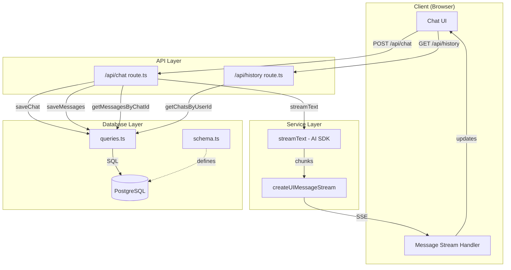
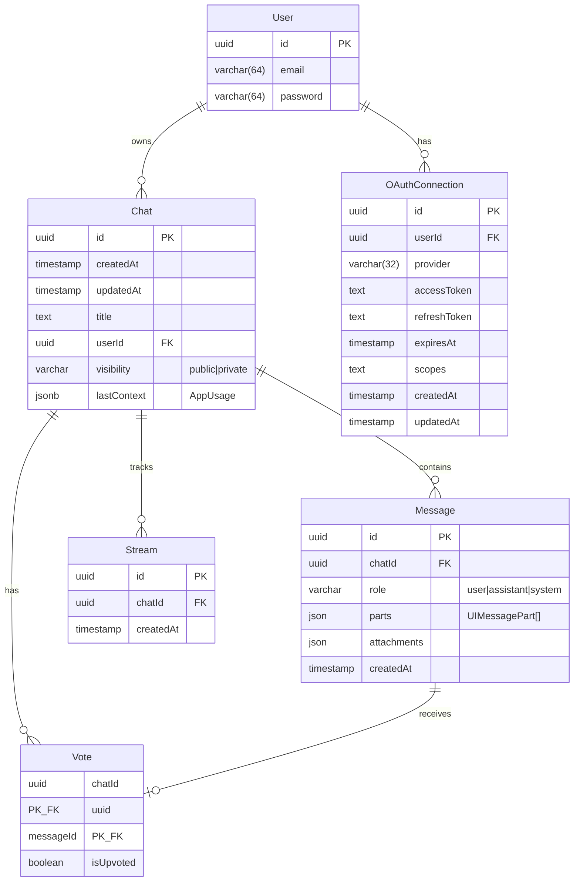
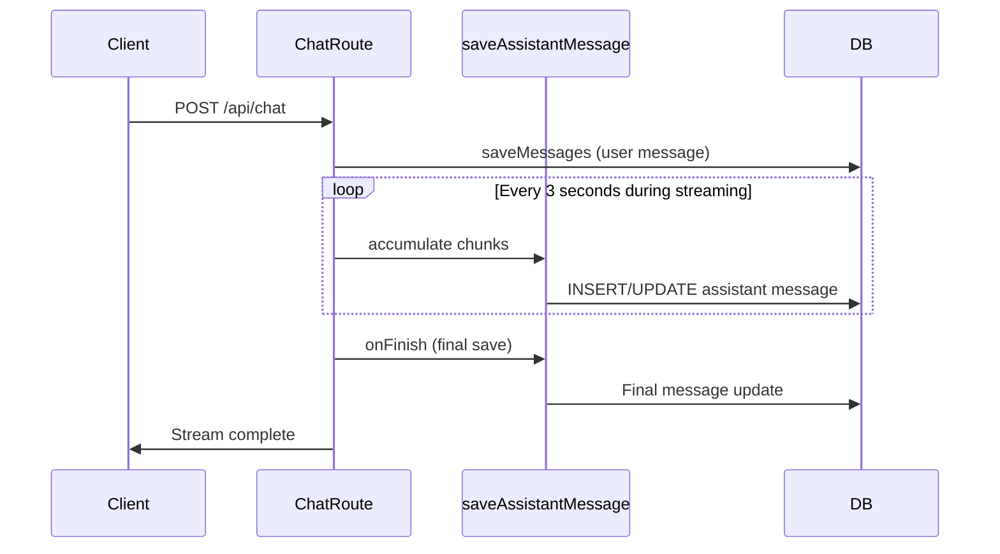

# Chat History System Architecture

This document provides a comprehensive analysis of the chat history implementation in the Daily Pulse chatbot application.

## Table of Contents

- [Overview](#overview)
- [Data Flow Diagram](#data-flow-diagram)
- [Database Schema](#database-schema)
- [File/Class Responsibility Matrix](#fileclass-responsibility-matrix)
- [Message Structure](#message-structure)
- [User Isolation Mechanisms](#user-isolation-mechanisms)
- [Pagination and Retrieval](#pagination-and-retrieval)
- [Code References](#code-references)

---

## Overview

The chat history system manages the persistence and retrieval of conversations between users and the AI assistant. It uses PostgreSQL as the primary data store with Drizzle ORM for database operations. The system supports:

- Multi-turn conversations with message threading
- User-scoped data isolation
- Progressive message saving during streaming
- Visibility controls (public/private chats)
- Vote/feedback tracking on messages

---

## Data Flow Diagram



---

## Database Schema



### Table Indexes

| Table | Index Name | Columns | Purpose |
|-------|-----------|---------|---------|
| Chat | `Chat_userId_updatedAt_idx` | `userId`, `updatedAt DESC` | Efficient pagination for user's chat history |

---

## File/Class Responsibility Matrix

| File | Responsibility | Key Exports |
|------|---------------|-------------|
| `lib/db/schema.ts` | Database schema definitions using Drizzle ORM | `user`, `chat`, `message`, `vote`, `stream`, `oauthConnection` tables and types |
| `lib/db/queries.ts` | Database query functions for CRUD operations | `saveChat`, `saveMessages`, `getMessagesByChatId`, `getChatsByUserId`, `deleteChatById`, etc. |
| `app/(chat)/api/chat/route.ts` | Main chat API endpoint - handles message creation and streaming | `POST`, `PATCH`, `DELETE` handlers |
| `app/(chat)/api/history/route.ts` | Chat history listing API | `GET`, `DELETE` handlers |
| `lib/utils.ts` | Utility functions for message conversion | `convertToUIMessages`, `generateUUID` |
| `lib/types.ts` | TypeScript type definitions | `ChatMessage`, `ChatTools`, `CustomUIDataTypes` |
| `components/sidebar-history.tsx` | UI component for displaying chat history | `SidebarHistory` component |
| `components/messages.tsx` | UI component for rendering messages | `Messages` component |

---

## Message Structure

### Database Message (DBMessage)

```typescript
// lib/db/schema.ts:65-76
interface DBMessage {
  id: string;           // UUID
  chatId: string;       // FK to Chat
  role: string;         // "user" | "assistant" | "system"
  parts: json;          // UIMessagePart[] - structured content
  attachments: json;    // File attachments
  createdAt: Date;
}
```

### UI Message Parts Structure

Messages use a `parts` array that can contain multiple content types:

```typescript
// Based on AI SDK UIMessagePart types
type UIMessagePart = 
  | { type: "text"; text: string }
  | { type: "reasoning"; text: string }
  | { type: "tool-invocation"; toolName: string; args: object; result?: any }
  | { type: "file"; url: string; mediaType: string }
  | { type: "source"; ... };
```

### Example Message Parts

```json
{
  "id": "550e8400-e29b-41d4-a716-446655440000",
  "chatId": "123e4567-e89b-12d3-a456-426614174000",
  "role": "assistant",
  "parts": [
    { "type": "text", "text": "Here's the weather forecast..." },
    { 
      "type": "tool-invocation",
      "toolName": "getWeather",
      "args": { "location": "San Francisco" },
      "result": { "temperature": 65, "condition": "sunny" }
    }
  ],
  "attachments": [],
  "createdAt": "2024-01-15T10:30:00.000Z"
}
```

---

## User Isolation Mechanisms

### 1. Chat Ownership

Every chat is tied to a user via the `userId` foreign key:

```typescript
// lib/db/schema.ts:33-35
userId: uuid("userId")
  .notNull()
  .references(() => user.id),
```

### 2. API Authorization Checks

All chat operations verify user ownership:

```typescript
// app/(chat)/api/chat/route.ts:177-179
if (chat.userId !== session.user.id) {
  return new ChatSDKError("forbidden:chat").toResponse();
}
```

### 3. Query-Level Isolation

User-specific queries always filter by `userId`:

```typescript
// lib/db/queries.ts:178-186
const query = (whereCondition?: SQL<any>) =>
  db
    .select()
    .from(chat)
    .where(
      whereCondition
        ? and(whereCondition, eq(chat.userId, id))
        : eq(chat.userId, id),
    )
```

---

## Pagination and Retrieval

### Chat History Pagination

Uses cursor-based pagination with `updatedAt` timestamp:

```typescript
// lib/db/queries.ts:164-256
export async function getChatsByUserId({
  id,
  limit,
  startingAfter,  // cursor for forward pagination
  endingBefore,   // cursor for backward pagination
})
```

### Message Retrieval

Messages are retrieved in chronological order:

```typescript
// lib/db/queries.ts:296-309
export async function getMessagesByChatId({ id }: { id: string }) {
  return await db
    .select()
    .from(message)
    .where(eq(message.chatId, id))
    .orderBy(asc(message.createdAt));
}
```

---

## Progressive Message Saving

During streaming, assistant messages are saved incrementally:



Key implementation details:

- `SAVE_INTERVAL_MS = 3000` - Save every 3 seconds
- Uses `after()` hook for reliable final save even on timeout
- Prevents duplicate saves with `finalSaveCompleted` flag

---

## Code References

### Schema Definitions

- **Chat table**: `lib/db/schema.ts:26-47`
- **Message table**: `lib/db/schema.ts:65-76`
- **Vote table**: `lib/db/schema.ts:100-118`
- **Stream table**: `lib/db/schema.ts:169-185`

### Query Functions

- **saveChat**: `lib/db/queries.ts:88-112`
- **saveMessages**: `lib/db/queries.ts:271-277`
- **getMessagesByChatId**: `lib/db/queries.ts:296-309`
- **getChatsByUserId**: `lib/db/queries.ts:164-256`
- **deleteChatById**: `lib/db/queries.ts:114-131`
- **deleteAllChatsByUserId**: `lib/db/queries.ts:133-162`
- **updateMessageById**: `lib/db/queries.ts:279-294`

### API Endpoints

- **Chat POST handler**: `app/(chat)/api/chat/route.ts:126-632`
- **Chat DELETE handler**: `app/(chat)/api/chat/route.ts:697-720`
- **History GET handler**: `app/(chat)/api/history/route.ts:6-34`
- **History DELETE handler**: `app/(chat)/api/history/route.ts:36-46`

### UI Components

- **Message rendering**: `components/messages.tsx:1-117`
- **Sidebar history**: `components/sidebar-history.tsx:1-369`
- **Message conversion utility**: `lib/utils.ts:106-115`

### Type Definitions

- **ChatMessage type**: `lib/types.ts:87-92`
- **DBMessage type**: `lib/db/schema.ts:76`
- **Chat type**: `lib/db/schema.ts:49`

---

## Summary

The chat history system is a well-structured implementation using:

1. **PostgreSQL** with Drizzle ORM for type-safe database operations
2. **Parts-based message format** supporting rich content (text, tools, files)
3. **User-scoped isolation** at both query and API authorization levels
4. **Cursor-based pagination** for efficient history retrieval
5. **Progressive saving** for resilient streaming operations

This architecture provides a solid foundation for integrating vector-based semantic search, as messages already have structured parts that can be embedded and indexed.
