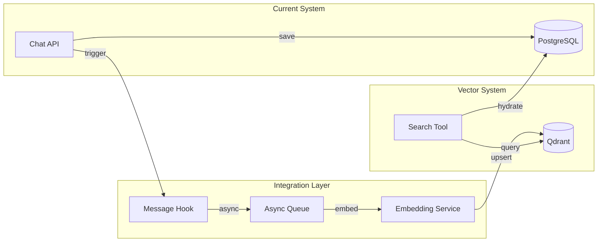
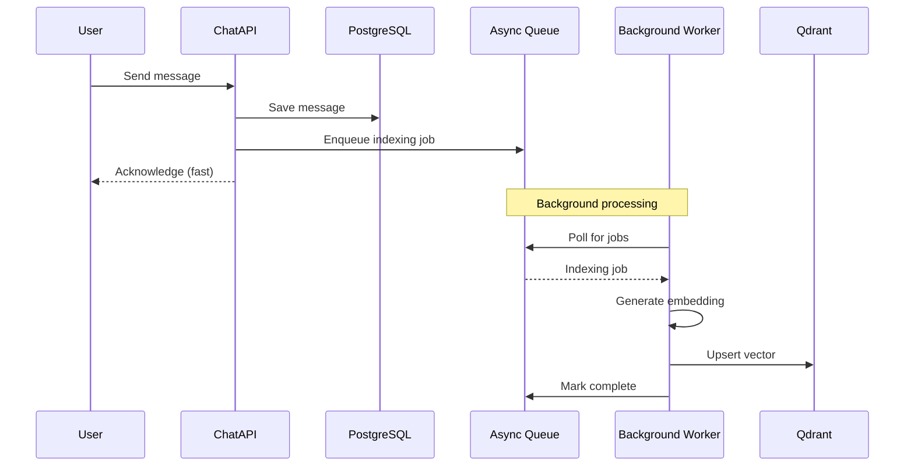
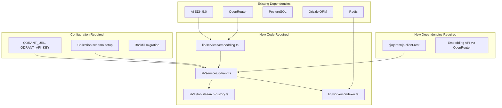

# Chat-Vector Integration Analysis

This document analyzes how the chat history system and vector database can be integrated to enable semantic search across past conversations.

## Table of Contents

- [Integration Overview](#integration-overview)
- [Integration Points](#integration-points)
- [Timing Considerations](#timing-considerations)
- [Event/Hook Systems](#eventhook-systems)
- [Technical Constraints](#technical-constraints)
- [Dependency Diagram](#dependency-diagram)
- [Feasibility Rankings](#feasibility-rankings)
- [Recommendations](#recommendations)

---

## Integration Overview



---

## Integration Points

### 1. Message Save Hook (Primary)

**Location**: `app/(chat)/api/chat/route.ts:269-326`

The `saveAssistantMessage` function is called:
- Progressively during streaming (every 3 seconds)
- On stream completion (`onFinish`)
- As a fallback via `after()` hook

```typescript
// Current implementation (simplified)
const saveAssistantMessage = async (force = false) => {
  const parts = buildMessageParts();
  
  if (!messageSaved) {
    await saveMessages({ messages: [/* ... */] });
    messageSaved = true;
  } else {
    await updateMessageById({ id, parts });
  }
};
```

**Integration Opportunity**:
```typescript
// Enhanced with vector indexing
const saveAssistantMessage = async (force = false) => {
  const parts = buildMessageParts();
  
  if (!messageSaved) {
    await saveMessages({ messages: [/* ... */] });
    // Trigger async indexing
    await queueForIndexing(assistantMessageId, parts, userId);
    messageSaved = true;
  }
  // Only index final version, not intermediate updates
};
```

**Feasibility**: ⭐⭐⭐⭐⭐ (5/5) - Natural integration point

---

### 2. User Message Save (Secondary)

**Location**: `app/(chat)/api/chat/route.ts:230-244`

User messages are saved before streaming begins:

```typescript
await saveMessages({
  messages: [{
    chatId: id,
    id: message.id,
    role: "user",
    parts: message.parts,
    attachments: [],
    createdAt: new Date(),
  }],
});
```

**Integration Opportunity**:
```typescript
// Index user messages for context
await saveMessages({ messages: [/* ... */] });
await queueForIndexing(message.id, message.parts, session.user.id);
```

**Feasibility**: ⭐⭐⭐⭐⭐ (5/5) - Simple addition

---

### 3. Chat Deletion Cascade

**Location**: `lib/db/queries.ts:114-131`

Current deletion flow:
```typescript
export async function deleteChatById({ id }) {
  await db.delete(vote).where(eq(vote.chatId, id));
  await db.delete(message).where(eq(message.chatId, id));
  await db.delete(stream).where(eq(stream.chatId, id));
  const [deleted] = await db.delete(chat).where(eq(chat.id, id)).returning();
  return deleted;
}
```

**Integration Requirement**:
```typescript
// Must cascade to vector database
export async function deleteChatById({ id }) {
  // Get message IDs first
  const messages = await db.select({ id: message.id })
    .from(message).where(eq(message.chatId, id));
  
  // Delete vectors
  await vectorClient.deleteByFilter("chat_messages", {
    must: [{ key: "chat_id", match: { value: id } }]
  });
  
  // Existing deletions...
}
```

**Feasibility**: ⭐⭐⭐⭐ (4/5) - Requires transaction coordination

---

### 4. Bulk User Data Deletion

**Location**: `lib/db/queries.ts:133-162`

For GDPR compliance:
```typescript
export async function deleteAllChatsByUserId({ userId }) {
  // Must also clear all user vectors
  await vectorClient.deleteByFilter("chat_messages", {
    must: [{ key: "user_id", match: { value: userId } }]
  });
  // ... existing logic
}
```

**Feasibility**: ⭐⭐⭐⭐⭐ (5/5) - Simple filter-based deletion

---

### 5. Tool System Integration (Search Tool)

**Location**: `lib/ai/tools/` directory

Current tools pattern:
```typescript
// lib/ai/tools/web-fetch.ts
export const webFetch = tool({
  description: "Fetch content from a URL...",
  inputSchema: z.object({
    url: z.string().url(),
    responseType: z.enum(["json", "text"]),
  }),
  execute: async ({ url, responseType }) => { /* ... */ },
});
```

**New Search Tool**:
```typescript
// lib/ai/tools/search-history.ts
export const searchPastConversations = ({ userId }) => tool({
  description: "Search past conversations for relevant context",
  inputSchema: z.object({
    query: z.string(),
    limit: z.number().optional().default(5),
    timeRange: z.object({
      after: z.string().optional(),
      before: z.string().optional(),
    }).optional(),
  }),
  execute: async ({ query, limit, timeRange }) => {
    // Embed query
    // Search Qdrant with user_id filter
    // Return formatted results
  },
});
```

**Feasibility**: ⭐⭐⭐⭐⭐ (5/5) - Follows existing patterns

---

## Timing Considerations

### Synchronous vs Asynchronous Indexing

| Approach | Pros | Cons | Recommendation |
|----------|------|------|----------------|
| **Sync** | Consistent data | Adds latency, blocks response | ❌ Not recommended |
| **Async (in-process)** | Simple, no extra infra | May lose data on crash | ⚠️ Acceptable for MVP |
| **Async (queue)** | Reliable, scalable | Requires Redis/queue | ✅ Recommended for production |

### Recommended Flow



### Latency Budget

| Operation | Target | Notes |
|-----------|--------|-------|
| Message save | < 100ms | Current performance |
| Embedding generation | < 500ms | Async, not blocking |
| Vector upsert | < 100ms | Async, not blocking |
| **Search query** | < 200ms | **User-facing, must be fast** |

---

## Event/Hook Systems

### Current Hooks in Use

1. **Next.js `after()` hook**: `app/(chat)/api/chat/route.ts:329-336`
   - Used for guaranteed final message save
   - Can be extended for indexing

2. **AI SDK `onFinish`**: `app/(chat)/api/chat/route.ts:496-550`
   - Called when streaming completes
   - Natural place for final indexing

3. **AI SDK `onChunk`**: `app/(chat)/api/chat/route.ts:482-495`
   - Called for each streaming chunk
   - Not suitable for indexing (too frequent)

### Proposed Event System

```typescript
// lib/events/message-events.ts
import { EventEmitter } from "events";

export const messageEvents = new EventEmitter();

// Events
messageEvents.on("message:created", async ({ messageId, parts, userId }) => {
  await queueForIndexing(messageId, parts, userId);
});

messageEvents.on("message:deleted", async ({ messageId }) => {
  await removeFromIndex(messageId);
});

messageEvents.on("chat:deleted", async ({ chatId }) => {
  await removeFromIndexByChatId(chatId);
});
```

---

## Technical Constraints

### 1. Memory Constraints

| Resource | Limit | Impact |
|----------|-------|--------|
| Vercel Serverless | 1GB RAM | Large batches may fail |
| Streaming duration | 60s max | Long conversations need chunking |
| Embedding batch size | ~100 texts | Rate limiting consideration |

**Mitigation**: Use async background processing, not in-request.

### 2. Latency Requirements

- **Search tool**: Must return within 200ms
- **Embedding API call**: Typically 100-300ms
- **Qdrant query**: Typically 10-50ms

**Mitigation**: Cache frequent queries, use efficient embedding model.

### 3. Cost Considerations

| Component | Cost | Volume Estimate |
|-----------|------|-----------------|
| Embedding API | ~$0.02/1M tokens | ~$0.10/user/month |
| Qdrant Cloud | Free tier: 1GB | ~100K messages |
| Additional compute | Vercel pricing | Background functions |

### 4. Data Consistency

- PostgreSQL is source of truth
- Vector index is derivative/secondary
- Must handle sync failures gracefully

**Mitigation**: 
- Async indexing with retry
- Periodic reconciliation job
- Track last indexed timestamp

---

## Dependency Diagram



---

## Feasibility Rankings

### Integration Points Ranked

| Integration Point | Complexity | Impact | Priority | Score |
|-------------------|------------|--------|----------|-------|
| Search Tool | Low | High | P0 | ⭐⭐⭐⭐⭐ |
| User Message Indexing | Low | Medium | P0 | ⭐⭐⭐⭐⭐ |
| Assistant Message Indexing | Medium | High | P0 | ⭐⭐⭐⭐ |
| Chat Deletion Cascade | Medium | High | P1 | ⭐⭐⭐⭐ |
| User Data Deletion | Low | High (GDPR) | P1 | ⭐⭐⭐⭐⭐ |
| Backfill Migration | High | Medium | P2 | ⭐⭐⭐ |

### Implementation Order

1. **Phase 1 (MVP)**
   - Vector service setup
   - Search tool
   - User message indexing
   - Assistant message indexing (on completion only)

2. **Phase 2 (Production Ready)**
   - Async queue-based indexing
   - Deletion cascades
   - Error handling and retries

3. **Phase 3 (Enhancement)**
   - Backfill migration
   - Advanced filtering (topics, date ranges)
   - Caching layer

---

## Recommendations

### 1. Start Simple
- Index only completed messages (not streaming updates)
- Use synchronous indexing for MVP
- Single collection for all messages

### 2. Leverage Existing Infrastructure
- Use Redis for job queue (already configured)
- Use OpenRouter for embeddings (existing provider)
- Follow existing tool patterns

### 3. Ensure User Isolation
- Filter by `user_id` on ALL queries
- No cross-user data access
- Audit logging for compliance

### 4. Plan for Scale
- Async indexing from day 1
- Pagination for search results
- Index-time vs query-time filtering

### 5. Handle Failures Gracefully
- Log indexing failures, don't block saves
- Retry mechanism for transient failures
- Reconciliation job for drift detection

---

## Summary

The integration of chat history with vector search is highly feasible given:

1. ✅ Qdrant infrastructure already provisioned
2. ✅ Clear integration points in message save flow
3. ✅ Existing tool system for search tool
4. ✅ Redis available for async processing
5. ✅ OpenRouter can provide embeddings

**Key Success Factors**:
- Async indexing to maintain response times
- User isolation at query level
- Graceful degradation on failures
- Clear data lifecycle management
