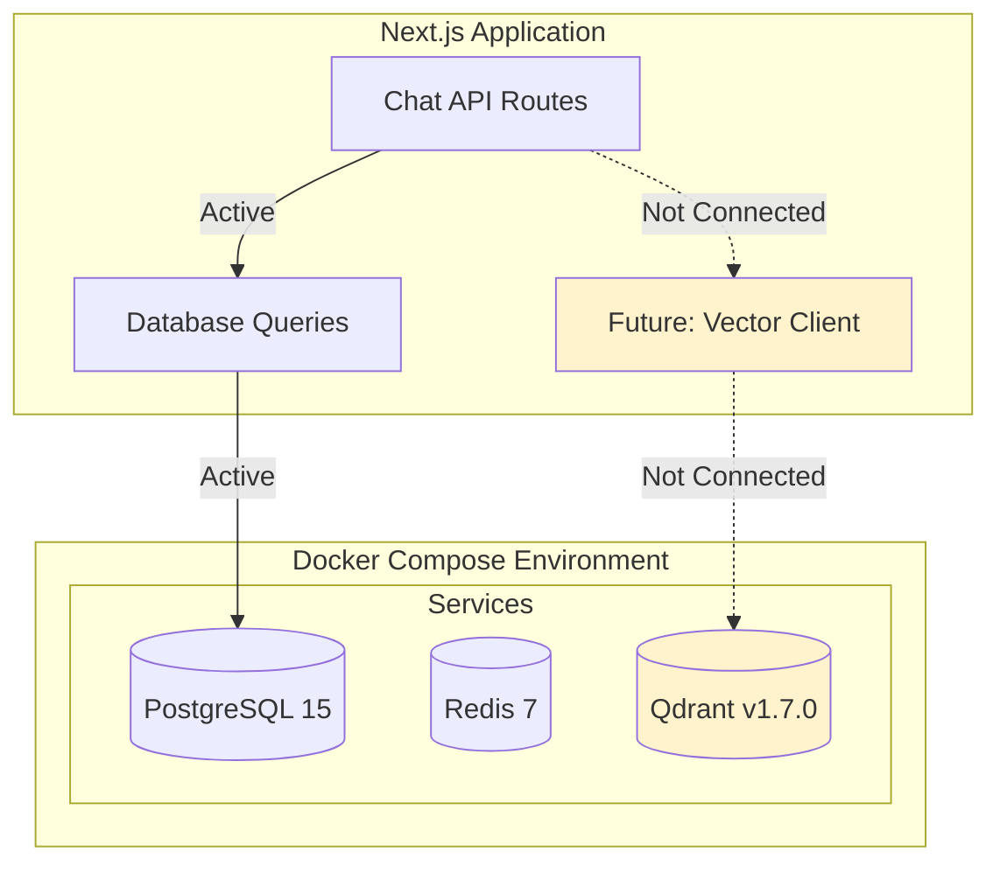
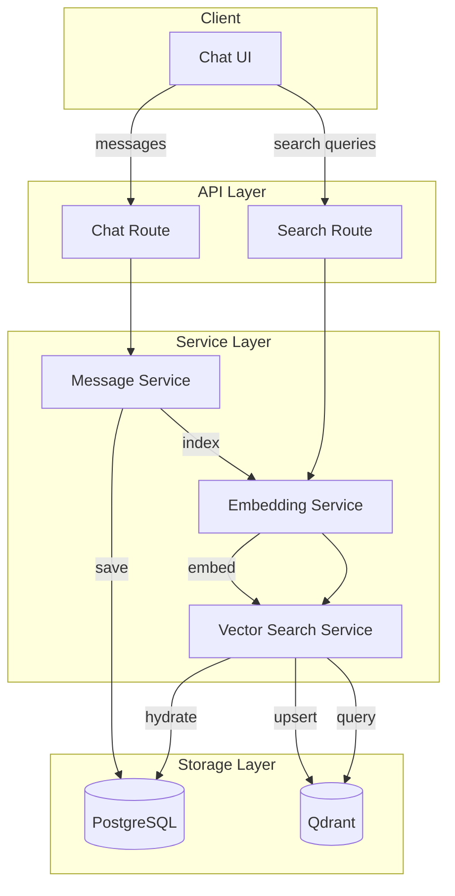
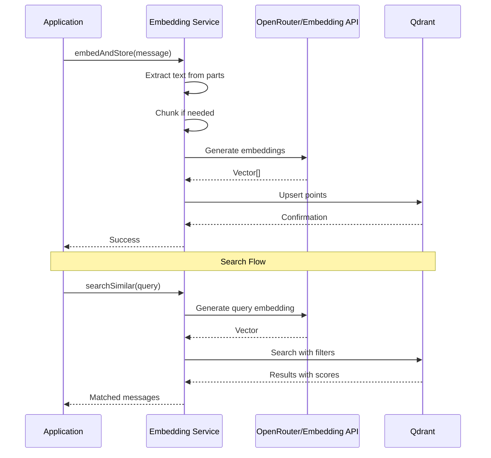

# Vector Database System Architecture

This document provides a comprehensive analysis of the vector database implementation in the Daily Pulse chatbot application.

## Table of Contents

- [Overview](#overview)
- [Technology Stack](#technology-stack)
- [Architecture Diagram](#architecture-diagram)
- [Current Configuration](#current-configuration)
- [Integration Status](#integration-status)
- [Embedding Pipeline Analysis](#embedding-pipeline-analysis)
- [Implementation Patterns](#implementation-patterns)
- [Configuration Reference](#configuration-reference)
- [Code References](#code-references)

---

## Overview

The Daily Pulse chatbot has **Qdrant** vector database infrastructure provisioned but **not yet actively integrated** into the application code. The infrastructure is set up via Docker Compose for local development, with configuration files present. This provides a ready foundation for implementing semantic search features.

---

## Technology Stack

| Component | Technology | Status |
|-----------|------------|--------|
| Vector Database | Qdrant v1.7.0 | ✅ Provisioned (Docker) |
| Client Library | Not yet installed | ⏳ Pending |
| Embedding Model | Not yet configured | ⏳ Pending |
| REST API Port | 6333 | ✅ Configured |
| gRPC Port | 6334 | ✅ Configured |

---

## Architecture Diagram

### Current State (Infrastructure Only)



### Target State (After Implementation)



---

## Current Configuration

### Docker Compose Setup

```yaml
# docker-compose.yml:20-27
qdrant:
  image: qdrant/qdrant:v1.7.0
  ports:
    - "6333:6333"   # REST API
    - "6334:6334"   # gRPC
  volumes:
    - qdrant_data:/qdrant/storage
    - ./qdrant-config.yaml:/qdrant/config/production.yaml
```

### Qdrant Configuration

```yaml
# qdrant-config.yaml
storage:
  optimizers:
    indexing_threshold_kb: 1000   # Index segments when > 1MB
    default_segment_number: 2     # Default segment count

service:
  http_port: 6333
  grpc_port: 6334
```

### Configuration Analysis

| Setting | Value | Purpose |
|---------|-------|---------|
| `indexing_threshold_kb` | 1000 | Controls when in-memory segments are indexed to disk. Lower values = more frequent indexing |
| `default_segment_number` | 2 | Number of segments per collection for parallel processing |
| `http_port` | 6333 | REST API endpoint for CRUD operations |
| `grpc_port` | 6334 | High-performance gRPC endpoint for bulk operations |

---

## Integration Status

### Currently Missing Components

1. **Qdrant Client Library**
   - Package not in `package.json`
   - Recommended: `@qdrant/js-client-rest` (official TypeScript client)

2. **Embedding Model Integration**
   - No embedding model configured
   - Options via OpenRouter: OpenAI `text-embedding-3-small`, Cohere, etc.
   - Alternative: Use Vercel AI SDK's embedding API

3. **Vector Service Layer**
   - No `lib/services/vector.ts` or similar
   - No collection schema definitions
   - No embedding pipeline code

4. **Environment Variables**
   - `QDRANT_URL` not in `.env.example`
   - `QDRANT_API_KEY` not configured (needed for cloud deployments)

---

## Embedding Pipeline Analysis

### Recommended Architecture



### Embedding Model Options

| Model | Provider | Dimensions | Cost | Performance |
|-------|----------|------------|------|-------------|
| `text-embedding-3-small` | OpenAI | 1536 | $0.02/1M tokens | Fast, good quality |
| `text-embedding-3-large` | OpenAI | 3072 | $0.13/1M tokens | Best quality |
| `embed-english-v3.0` | Cohere | 1024 | $0.10/1M tokens | Good for English |
| `voyage-large-2` | Voyage | 1536 | $0.12/1M tokens | High quality |

**Recommendation**: Start with `text-embedding-3-small` for cost-efficiency.

---

## Implementation Patterns

### Qdrant Collection Schema (Proposed)

```typescript
// Proposed schema for chat_messages collection
interface ChatMessagePoint {
  id: string;              // message_id or generated UUID
  vector: number[];        // Embedding vector
  payload: {
    user_id: string;       // Required for isolation
    chat_id: string;       // Conversation grouping
    message_id: string;    // Link to PostgreSQL
    role: "user" | "assistant";
    content_preview: string;  // First 500 chars
    timestamp: string;     // ISO 8601
    topics?: string[];     // Optional tags
  };
}
```

### Collection Configuration (Proposed)

```typescript
// Recommended collection settings
const collectionConfig = {
  vectors: {
    size: 1536,  // For text-embedding-3-small
    distance: "Cosine",
  },
  optimizers_config: {
    indexing_threshold: 10000,  // Index when > 10k points
  },
  hnsw_config: {
    m: 16,           // Connections per node
    ef_construct: 100,  // Build-time accuracy
  },
  on_disk_payload: true,  // Memory optimization
};
```

### Basic Client Pattern

```typescript
// lib/services/qdrant.ts (proposed structure)
import { QdrantClient } from "@qdrant/js-client-rest";

const client = new QdrantClient({
  url: process.env.QDRANT_URL || "http://localhost:6333",
  apiKey: process.env.QDRANT_API_KEY,
});

export async function upsertMessage(
  messageId: string,
  embedding: number[],
  metadata: MessageMetadata
) {
  return client.upsert("chat_messages", {
    wait: true,
    points: [{
      id: messageId,
      vector: embedding,
      payload: metadata,
    }],
  });
}

export async function searchMessages(
  embedding: number[],
  userId: string,
  limit: number = 5
) {
  return client.search("chat_messages", {
    vector: embedding,
    limit,
    filter: {
      must: [{ key: "user_id", match: { value: userId } }],
    },
    with_payload: true,
  });
}
```

---

## Configuration Reference

### Environment Variables (Required for Production)

```bash
# .env.local (add these)
QDRANT_URL=http://localhost:6333    # or cloud URL
QDRANT_API_KEY=                     # Required for Qdrant Cloud
EMBEDDING_MODEL=text-embedding-3-small
EMBEDDING_DIMENSIONS=1536
```

### Docker Compose Commands

```bash
# Start Qdrant locally
docker compose up qdrant -d

# View logs
docker compose logs qdrant

# Access REST API
curl http://localhost:6333/collections

# Stop
docker compose down
```

### Qdrant REST API Examples

```bash
# Create collection
curl -X PUT 'http://localhost:6333/collections/chat_messages' \
  -H 'Content-Type: application/json' \
  -d '{
    "vectors": {
      "size": 1536,
      "distance": "Cosine"
    }
  }'

# List collections
curl 'http://localhost:6333/collections'

# Search
curl -X POST 'http://localhost:6333/collections/chat_messages/points/search' \
  -H 'Content-Type: application/json' \
  -d '{
    "vector": [0.1, 0.2, ...],
    "limit": 5,
    "filter": {
      "must": [{"key": "user_id", "match": {"value": "user-123"}}]
    }
  }'
```

---

## Code References

### Infrastructure Configuration
- **Docker Compose service**: `docker-compose.yml:20-27`
- **Qdrant config**: `qdrant-config.yaml:1-7`

### Related Dependencies (package.json)
- **AI SDK**: `ai: 5.0.105` - Could use for embeddings
- **OpenRouter**: `@openrouter/ai-sdk-provider: ^1.2.8` - Current LLM provider

### Future Integration Points
- **Message save hook**: `app/(chat)/api/chat/route.ts:269-326`
- **Chat delete cascade**: `lib/db/queries.ts:114-131`
- **Tool system**: `lib/ai/tools/` - For semantic search tool

---

## Deployment Considerations

### Local Development
- Use Docker Compose for Qdrant
- No authentication required
- Data persisted in Docker volume

### Production (Qdrant Cloud)
- Sign up at [cloud.qdrant.io](https://cloud.qdrant.io)
- Get cluster URL and API key
- Configure `QDRANT_URL` and `QDRANT_API_KEY`
- Free tier: 1GB storage, suitable for initial deployment

### Self-Hosted Production
- Deploy Qdrant on Kubernetes or Docker
- Configure TLS and authentication
- Set up monitoring and backups

---

## Summary

The Daily Pulse application has **infrastructure ready** for vector search:

| Component | Status | Action Required |
|-----------|--------|-----------------|
| Qdrant Server | ✅ Configured | Start with `docker compose up` |
| Client Library | ❌ Missing | Install `@qdrant/js-client-rest` |
| Embedding Model | ❌ Missing | Configure via OpenRouter or AI SDK |
| Vector Service | ❌ Missing | Create `lib/services/qdrant.ts` |
| Collection Schema | ❌ Missing | Define and create collection |
| Search Tool | ❌ Missing | Add to `lib/ai/tools/` |

The foundation is solid, and implementation can proceed following the patterns outlined in this document.
