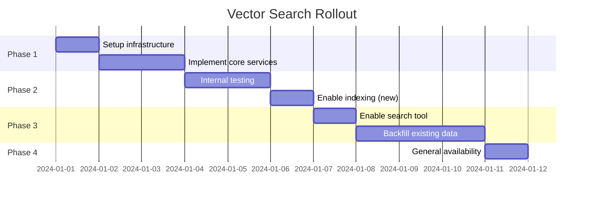

# Chat History Vector Search Implementation Plan

A production-ready implementation plan for enabling semantic search across chat history using Qdrant vector database.

## Table of Contents

- [Executive Summary](#executive-summary)
- [Data Model Design](#data-model-design)
- [Indexing Pipeline Design](#indexing-pipeline-design)
- [Retrieval & Tool Design](#retrieval--tool-design)
- [Security & Privacy](#security--privacy)
- [Performance & Scalability](#performance--scalability)
- [Migration & Rollout Strategy](#migration--rollout-strategy)
- [Implementation Checklist](#implementation-checklist)
- [Test Strategy](#test-strategy)
- [Appendix](#appendix)

---

## Executive Summary

This plan enables the Daily Pulse chatbot to semantically search past conversations, allowing the AI to reference relevant prior context when responding to user queries.

**Goals**:
- Store chat messages in Qdrant vector database
- Enable semantic similarity search via AI tool
- Maintain strict user data isolation
- Support GDPR-compliant data deletion

**Estimated Timeline**: 5-7 days for core implementation

---

## Data Model Design

### 2.1.1 Embedding Unit

**Decision**: Embed individual messages (conversation turns)

| Option | Pros | Cons | Decision |
|--------|------|------|----------|
| Full message | Simple, natural unit | Works well | ✅ Selected |
| Conversation turn pair | Better context | Doubles storage | ❌ |
| Sliding window | Most context | Complex, expensive | ❌ |
| Summary | Compact | Lossy, additional processing | ❌ Phase 2 |

### Vector Point Schema

```typescript
// lib/types/vector.ts (NEW FILE)
export interface ChatMessageVectorPoint {
  id: string;  // Use message UUID from PostgreSQL
  vector: number[];  // 1536 dimensions for text-embedding-3-small
  payload: ChatMessageVectorPayload;
}

export interface ChatMessageVectorPayload {
  // Required - for isolation
  user_id: string;
  
  // Required - for grouping
  chat_id: string;
  message_id: string;
  
  // Required - for filtering
  timestamp: string;  // ISO 8601
  role: "user" | "assistant";
  
  // Required - for display
  content_preview: string;  // First 500 chars of text content
  
  // Optional - for enhanced filtering
  topics?: string[];
  has_tool_calls?: boolean;
}
```

### Qdrant Collection Configuration

```typescript
// Collection: chat_messages
const collectionConfig = {
  vectors: {
    size: 1536,
    distance: "Cosine",
    on_disk: true,  // For large collections
  },
  hnsw_config: {
    m: 16,
    ef_construct: 128,
    full_scan_threshold: 10000,
  },
  optimizers_config: {
    indexing_threshold: 20000,
    memmap_threshold: 50000,
  },
  payload_schema: {
    user_id: { type: "keyword", is_tenant: true },
    chat_id: { type: "keyword" },
    role: { type: "keyword" },
    timestamp: { type: "datetime" },
  },
};
```

### Chunking Strategy

For messages exceeding token limits:

```typescript
// lib/services/embedding.ts
const MAX_TOKENS = 8000;  // text-embedding-3-small limit is 8191

function chunkMessage(text: string): string[] {
  const tokens = estimateTokens(text);
  
  if (tokens <= MAX_TOKENS) {
    return [text];
  }
  
  // Split by paragraphs first, then sentences
  const paragraphs = text.split(/\n\n+/);
  const chunks: string[] = [];
  let currentChunk = "";
  
  for (const para of paragraphs) {
    if (estimateTokens(currentChunk + para) <= MAX_TOKENS) {
      currentChunk += (currentChunk ? "\n\n" : "") + para;
    } else {
      if (currentChunk) chunks.push(currentChunk);
      currentChunk = para;
    }
  }
  
  if (currentChunk) chunks.push(currentChunk);
  return chunks;
}
```

### Deduplication Strategy

- Use PostgreSQL `message.id` as Qdrant point ID
- Qdrant automatically overwrites on same ID
- No explicit dedup logic needed

---

## Indexing Pipeline Design

### 2.2.1 Trigger Mechanism

**Decision**: Hybrid approach - immediate async indexing + periodic reconciliation

```mermaid
flowchart TB
    subgraph Immediate["Immediate Indexing"]
        Save[Message Saved to PG]
        Hook[after() Hook]
        Queue[Redis Queue]
        Worker[Indexing Worker]
    end

    subgraph Reconciliation["Periodic Reconciliation"]
        Cron[Scheduled Job]
        Diff[Find Unindexed]
        Batch[Batch Index]
    end

    Save --> Hook
    Hook --> Queue
    Queue --> Worker
    Worker --> Qdrant[(Qdrant)]
    
    Cron --> Diff
    Diff --> Batch
    Batch --> Qdrant
```

### New Files Required

| File Path | Purpose | Complexity |
|-----------|---------|------------|
| `lib/services/qdrant.ts` | Qdrant client wrapper | M |
| `lib/services/embedding.ts` | Embedding generation | S |
| `lib/workers/message-indexer.ts` | Background indexer | M |
| `lib/ai/tools/search-history.ts` | Search tool | M |
| `lib/types/vector.ts` | Type definitions | S |

### lib/services/qdrant.ts

```typescript
// lib/services/qdrant.ts (NEW FILE)
import { QdrantClient } from "@qdrant/js-client-rest";
import type { ChatMessageVectorPayload } from "@/lib/types/vector";

const COLLECTION_NAME = "chat_messages";

let client: QdrantClient | null = null;

export function getQdrantClient(): QdrantClient {
  if (!client) {
    const url = process.env.QDRANT_URL || "http://localhost:6333";
    const apiKey = process.env.QDRANT_API_KEY;
    
    client = new QdrantClient({ url, apiKey });
  }
  return client;
}

export async function ensureCollection(): Promise<void> {
  const client = getQdrantClient();
  
  const exists = await client.collectionExists(COLLECTION_NAME);
  if (exists.exists) return;
  
  await client.createCollection(COLLECTION_NAME, {
    vectors: { size: 1536, distance: "Cosine" },
  });
  
  // Create payload indexes
  await client.createPayloadIndex(COLLECTION_NAME, {
    field_name: "user_id",
    field_schema: "keyword",
  });
  await client.createPayloadIndex(COLLECTION_NAME, {
    field_name: "timestamp",
    field_schema: "datetime",
  });
}

export async function upsertMessageVector(
  messageId: string,
  vector: number[],
  payload: ChatMessageVectorPayload
): Promise<void> {
  const client = getQdrantClient();
  
  await client.upsert(COLLECTION_NAME, {
    wait: true,
    points: [{
      id: messageId,
      vector,
      payload,
    }],
  });
}

export async function deleteByMessageId(messageId: string): Promise<void> {
  const client = getQdrantClient();
  await client.delete(COLLECTION_NAME, {
    wait: true,
    points: [messageId],
  });
}

export async function deleteByChatId(chatId: string): Promise<void> {
  const client = getQdrantClient();
  await client.delete(COLLECTION_NAME, {
    wait: true,
    filter: {
      must: [{ key: "chat_id", match: { value: chatId } }],
    },
  });
}

export async function deleteByUserId(userId: string): Promise<void> {
  const client = getQdrantClient();
  await client.delete(COLLECTION_NAME, {
    wait: true,
    filter: {
      must: [{ key: "user_id", match: { value: userId } }],
    },
  });
}

export async function searchSimilar(
  vector: number[],
  userId: string,
  options: {
    limit?: number;
    scoreThreshold?: number;
    chatId?: string;
    afterTimestamp?: string;
    beforeTimestamp?: string;
  } = {}
): Promise<SearchResult[]> {
  const client = getQdrantClient();
  
  const {
    limit = 5,
    scoreThreshold = 0.7,
    chatId,
    afterTimestamp,
    beforeTimestamp,
  } = options;
  
  const must: any[] = [
    { key: "user_id", match: { value: userId } },
  ];
  
  if (chatId) {
    must.push({ key: "chat_id", match: { value: chatId } });
  }
  
  if (afterTimestamp) {
    must.push({
      key: "timestamp",
      range: { gte: afterTimestamp },
    });
  }
  
  if (beforeTimestamp) {
    must.push({
      key: "timestamp",
      range: { lte: beforeTimestamp },
    });
  }
  
  const results = await client.search(COLLECTION_NAME, {
    vector,
    limit,
    score_threshold: scoreThreshold,
    filter: { must },
    with_payload: true,
  });
  
  return results.map(r => ({
    messageId: r.id as string,
    score: r.score,
    payload: r.payload as ChatMessageVectorPayload,
  }));
}

export interface SearchResult {
  messageId: string;
  score: number;
  payload: ChatMessageVectorPayload;
}
```

### lib/services/embedding.ts

```typescript
// lib/services/embedding.ts (NEW FILE)
import { embed } from "ai";
import { createOpenRouter } from "@openrouter/ai-sdk-provider";

const openrouter = createOpenRouter({
  apiKey: process.env.OPENROUTER_API_KEY,
});

const EMBEDDING_MODEL = "openai/text-embedding-3-small";

export async function generateEmbedding(text: string): Promise<number[]> {
  const { embedding } = await embed({
    model: openrouter.textEmbeddingModel(EMBEDDING_MODEL),
    value: text,
  });
  
  return embedding;
}

export async function generateEmbeddings(
  texts: string[]
): Promise<number[][]> {
  // Batch embedding for efficiency
  const { embeddings } = await embedMany({
    model: openrouter.textEmbeddingModel(EMBEDDING_MODEL),
    values: texts,
  });
  
  return embeddings;
}

export function extractTextFromParts(parts: unknown[]): string {
  if (!Array.isArray(parts)) return "";
  
  return parts
    .filter((p): p is { type: "text"; text: string } => 
      typeof p === "object" && p !== null && 
      (p as any).type === "text" && 
      typeof (p as any).text === "string"
    )
    .map(p => p.text)
    .join("\n");
}
```

### Modified: lib/db/queries.ts

Add vector cleanup to deletion functions:

```typescript
// lib/db/queries.ts - MODIFY EXISTING

import { deleteByChatId, deleteByUserId } from "@/lib/services/qdrant";

export async function deleteChatById({ id }: { id: string }) {
  try {
    // Delete from vector database first
    await deleteByChatId(id).catch(err => 
      console.warn("Vector deletion failed:", err)
    );
    
    // Existing deletions...
    await db.delete(vote).where(eq(vote.chatId, id));
    await db.delete(message).where(eq(message.chatId, id));
    await db.delete(stream).where(eq(stream.chatId, id));
    
    const [deleted] = await db.delete(chat)
      .where(eq(chat.id, id))
      .returning();
    return deleted;
  } catch (_error) {
    throw new ChatSDKError("bad_request:database", "Failed to delete chat");
  }
}

export async function deleteAllChatsByUserId({ userId }: { userId: string }) {
  try {
    // Delete all vectors for user (GDPR compliance)
    await deleteByUserId(userId).catch(err =>
      console.warn("Vector deletion failed:", err)
    );
    
    // Existing deletions...
  } catch (_error) {
    throw new ChatSDKError("bad_request:database", "Failed to delete chats");
  }
}
```

### Modified: app/(chat)/api/chat/route.ts

Add indexing hook after message save:

```typescript
// In saveAssistantMessage function, after messageSaved = true:

// Queue for vector indexing (fire and forget)
if (process.env.QDRANT_URL) {
  queueMessageForIndexing({
    messageId: assistantMessageId,
    chatId: id,
    userId: session.user.id,
    role: "assistant",
    parts,
  }).catch(err => console.warn("Index queue failed:", err));
}
```

### Backfill Strategy

```typescript
// lib/scripts/backfill-vectors.ts (NEW FILE)
import { db } from "@/lib/db";
import { chat, message } from "@/lib/db/schema";
import { generateEmbedding, extractTextFromParts } from "@/lib/services/embedding";
import { upsertMessageVector, ensureCollection } from "@/lib/services/qdrant";
import { eq, desc } from "drizzle-orm";

const BATCH_SIZE = 100;

export async function backfillVectors(options: {
  userId?: string;
  sinceDate?: Date;
  dryRun?: boolean;
}) {
  await ensureCollection();
  
  let processed = 0;
  let offset = 0;
  
  while (true) {
    // Fetch messages in batches, newest first
    const messages = await db
      .select({
        id: message.id,
        chatId: message.chatId,
        role: message.role,
        parts: message.parts,
        createdAt: message.createdAt,
        userId: chat.userId,
      })
      .from(message)
      .innerJoin(chat, eq(message.chatId, chat.id))
      .orderBy(desc(message.createdAt))
      .limit(BATCH_SIZE)
      .offset(offset);
    
    if (messages.length === 0) break;
    
    for (const msg of messages) {
      const text = extractTextFromParts(msg.parts as unknown[]);
      if (!text || text.length < 10) continue;  // Skip empty/tiny messages
      
      if (options.dryRun) {
        console.log(`Would index: ${msg.id}`);
        continue;
      }
      
      const embedding = await generateEmbedding(text);
      await upsertMessageVector(msg.id, embedding, {
        user_id: msg.userId,
        chat_id: msg.chatId,
        message_id: msg.id,
        role: msg.role as "user" | "assistant",
        timestamp: msg.createdAt.toISOString(),
        content_preview: text.slice(0, 500),
      });
      
      processed++;
      if (processed % 100 === 0) {
        console.log(`Processed ${processed} messages`);
      }
    }
    
    offset += BATCH_SIZE;
  }
  
  console.log(`Backfill complete. Processed ${processed} messages.`);
}
```

---

## Retrieval & Tool Design

### 2.3.1 Search Tool Interface

```typescript
// lib/ai/tools/search-history.ts (NEW FILE)
import { tool } from "ai";
import { z } from "zod";
import { generateEmbedding } from "@/lib/services/embedding";
import { searchSimilar } from "@/lib/services/qdrant";

interface SearchHistoryProps {
  userId: string;
}

export const searchPastConversations = ({ userId }: SearchHistoryProps) =>
  tool({
    description: `Search through your past conversations to find relevant context. 
Use this when the user references something they discussed before, or when you need 
to recall previous information. Results include conversation snippets with relevance scores.`,
    inputSchema: z.object({
      query: z
        .string()
        .describe("Semantic search query - describe what you're looking for"),
      limit: z
        .number()
        .min(1)
        .max(10)
        .optional()
        .default(5)
        .describe("Maximum number of results to return"),
      timeRange: z
        .object({
          after: z
            .string()
            .optional()
            .describe("ISO 8601 timestamp - only search after this date"),
          before: z
            .string()
            .optional()
            .describe("ISO 8601 timestamp - only search before this date"),
        })
        .optional()
        .describe("Optional time range filter"),
      conversationId: z
        .string()
        .optional()
        .describe("Limit search to a specific conversation"),
    }),
    execute: async ({ query, limit = 5, timeRange, conversationId }) => {
      try {
        // Generate embedding for query
        const queryEmbedding = await generateEmbedding(query);
        
        // Search Qdrant
        const results = await searchSimilar(queryEmbedding, userId, {
          limit,
          chatId: conversationId,
          afterTimestamp: timeRange?.after,
          beforeTimestamp: timeRange?.before,
          scoreThreshold: 0.65,  // Filter low relevance
        });
        
        if (results.length === 0) {
          return {
            success: true,
            message: "No relevant past conversations found.",
            results: [],
          };
        }
        
        return {
          success: true,
          message: `Found ${results.length} relevant conversation(s).`,
          results: results.map(r => ({
            content: r.payload.content_preview,
            conversationId: r.payload.chat_id,
            timestamp: r.payload.timestamp,
            role: r.payload.role,
            relevanceScore: Math.round(r.score * 100) / 100,
          })),
        };
      } catch (error) {
        console.error("Search history error:", error);
        return {
          success: false,
          message: "Failed to search past conversations.",
          results: [],
        };
      }
    },
  });
```

### Tool Registration

Modify `app/(chat)/api/chat/route.ts`:

```typescript
// Add to imports
import { searchPastConversations } from "@/lib/ai/tools/search-history";

// In the execute function, add to baseTools:
const baseTools = {
  getWeather,
  createDocument: createDocument({ session, dataStream }),
  // ... existing tools ...
  searchPastConversations: searchPastConversations({ 
    userId: session.user.id 
  }),
};

// Add to activeTools
const baseActiveTools: ToolName[] = [
  "getWeather",
  // ... existing tools ...
  "searchPastConversations",  // Always available
];
```

### Relevance Threshold

| Score Range | Meaning | Action |
|-------------|---------|--------|
| 0.85 - 1.0 | Highly relevant | Show prominently |
| 0.70 - 0.85 | Relevant | Include in results |
| 0.50 - 0.70 | Marginally relevant | Optional, filter by default |
| < 0.50 | Not relevant | Exclude |

### Context Injection

The search tool returns formatted results that the LLM can naturally reference:

```typescript
// Example tool result that LLM receives
{
  success: true,
  message: "Found 3 relevant conversation(s).",
  results: [
    {
      content: "Last week we discussed setting up a home server...",
      conversationId: "abc-123",
      timestamp: "2024-01-10T14:30:00Z",
      role: "assistant",
      relevanceScore: 0.89
    },
    // ...
  ]
}
```

---

## Security & Privacy

### 4.1 User Data Isolation

**Mandatory**: All Qdrant queries MUST include `user_id` filter.

```typescript
// lib/services/qdrant.ts - searchSimilar function
// This is enforced at the service level:
const must: any[] = [
  { key: "user_id", match: { value: userId } },  // REQUIRED
  // Additional filters are optional
];
```

### 4.2 Data Retention

| Event | Action |
|-------|--------|
| Message deleted | Remove vector |
| Chat deleted | Remove all chat vectors |
| User data deletion | Remove all user vectors |
| Account deletion | Remove all user vectors |

### 4.3 GDPR Compliance

```typescript
// Implemented in lib/db/queries.ts

// Right to erasure - single chat
await deleteByChatId(chatId);

// Right to erasure - all user data
await deleteByUserId(userId);
```

### 4.4 Access Control

- Search tool only accessible to authenticated users
- User ID derived from session, never from client input
- No admin/cross-user search functionality

### 4.5 Audit Logging (Recommended)

```typescript
// Future enhancement: lib/services/audit.ts
export async function logVectorAccess(
  userId: string,
  action: "search" | "delete",
  metadata: Record<string, unknown>
) {
  // Log to audit table or service
}
```

---

## Performance & Scalability

### 5.1 Latency Targets

| Operation | Target | Measurement Point |
|-----------|--------|-------------------|
| Search query | < 200ms | Tool execute return |
| Embedding generation | < 500ms | API call |
| Qdrant search | < 50ms | Database query |
| Message indexing | < 1s | Background, async |

### 5.2 Index Size Projections

| User Activity | Messages/Month | Vectors/Month | Storage (est.) |
|---------------|----------------|---------------|----------------|
| Light | 100 | 100 | ~600 KB |
| Medium | 500 | 500 | ~3 MB |
| Heavy | 2000 | 2000 | ~12 MB |

**Per-vector size**: ~6 KB (1536 floats × 4 bytes + payload)

### 5.3 Caching Strategy

```typescript
// lib/services/cache.ts (optional enhancement)
import { createClient } from "redis";

const SEARCH_CACHE_TTL = 300;  // 5 minutes

export async function cachedSearch(
  cacheKey: string,
  searchFn: () => Promise<SearchResult[]>
): Promise<SearchResult[]> {
  const cached = await redis.get(cacheKey);
  if (cached) return JSON.parse(cached);
  
  const results = await searchFn();
  await redis.setex(cacheKey, SEARCH_CACHE_TTL, JSON.stringify(results));
  return results;
}
```

### 5.4 Rate Limiting

```typescript
// lib/middleware/rate-limit.ts
// Apply to search tool endpoint

const SEARCH_RATE_LIMIT = {
  windowMs: 60 * 1000,  // 1 minute
  max: 20,  // 20 searches per minute per user
};
```

---

## Migration & Rollout Strategy

### 6.1 Feature Flag

```typescript
// lib/feature-flags.ts (NEW FILE)
export const featureFlags = {
  VECTOR_SEARCH_ENABLED: process.env.VECTOR_SEARCH_ENABLED === "true",
  VECTOR_INDEXING_ENABLED: process.env.VECTOR_INDEXING_ENABLED === "true",
};

// Usage in code:
if (featureFlags.VECTOR_SEARCH_ENABLED) {
  activeTools.push("searchPastConversations");
}

if (featureFlags.VECTOR_INDEXING_ENABLED) {
  await queueMessageForIndexing(/* ... */);
}
```

### 6.2 Environment Variables

Add to `.env.example`:

```bash
# Vector Search Configuration
QDRANT_URL=http://localhost:6333
QDRANT_API_KEY=              # Required for Qdrant Cloud
VECTOR_SEARCH_ENABLED=false  # Feature flag
VECTOR_INDEXING_ENABLED=false  # Feature flag
```

### 6.3 Rollout Phases



### 6.4 Backfill Plan

1. **Priority**: Most recent conversations first
2. **Batching**: 100 messages per batch
3. **Rate limiting**: 10 batches/minute to avoid API limits
4. **Progress tracking**: Log last processed timestamp

```bash
# Run backfill script
BACKFILL_BATCH_SIZE=100 \
BACKFILL_SINCE_DAYS=30 \
npx tsx lib/scripts/backfill-vectors.ts
```

### 6.5 Rollback Procedure

```bash
# 1. Disable features
VECTOR_SEARCH_ENABLED=false
VECTOR_INDEXING_ENABLED=false

# 2. Redeploy
vercel --prod

# 3. (Optional) Clear collection
curl -X DELETE "$QDRANT_URL/collections/chat_messages"
```

### 6.6 Monitoring & Alerting

| Metric | Threshold | Alert |
|--------|-----------|-------|
| Search latency p95 | > 500ms | Warning |
| Search latency p99 | > 1s | Critical |
| Indexing failures | > 5% | Warning |
| Qdrant availability | < 99% | Critical |

---

## Implementation Checklist

### Phase 1: Foundation (Day 1-2)

- [ ] Install dependencies
  ```bash
  pnpm add @qdrant/js-client-rest
  ```
- [ ] Create `lib/types/vector.ts`
- [ ] Create `lib/services/qdrant.ts`
- [ ] Create `lib/services/embedding.ts`
- [ ] Add environment variables to `.env.example`
- [ ] Create Qdrant collection (manual or startup script)

### Phase 2: Core Features (Day 2-4)

- [ ] Create `lib/ai/tools/search-history.ts`
- [ ] Register search tool in chat route
- [ ] Add feature flags
- [ ] Modify message save to queue indexing
- [ ] Implement chat deletion cascade
- [ ] Implement user deletion cascade

### Phase 3: Testing & Polish (Day 4-5)

- [ ] Write unit tests for services
- [ ] Write integration tests for search tool
- [ ] Test with various query types
- [ ] Performance testing

### Phase 4: Backfill & Launch (Day 5-7)

- [ ] Create backfill script
- [ ] Run backfill on staging
- [ ] Enable features in production
- [ ] Run production backfill
- [ ] Monitor and iterate

---

## Test Strategy

### Unit Tests

```typescript
// lib/services/__tests__/qdrant.test.ts
describe("Qdrant Service", () => {
  it("should enforce user_id filter on search", async () => {
    // Verify user isolation
  });
  
  it("should handle empty results gracefully", async () => {
    // Verify empty result handling
  });
  
  it("should delete by chat_id correctly", async () => {
    // Verify cascade deletion
  });
});
```

### Integration Tests

```typescript
// tests/vector-search.spec.ts
test("search returns relevant results", async ({ page }) => {
  // 1. Create a conversation about a specific topic
  // 2. Create another conversation  
  // 3. Search for the first topic
  // 4. Verify search tool returns correct conversation
});
```

### Performance Tests

```typescript
// tests/performance/search.test.ts
test("search completes within 200ms", async () => {
  const start = Date.now();
  await searchSimilar(queryVector, userId, { limit: 5 });
  const duration = Date.now() - start;
  expect(duration).toBeLessThan(200);
});
```

---

## Appendix

### A. Cost Estimates

| Component | Cost/Month (1000 users) |
|-----------|-------------------------|
| Embeddings (text-embedding-3-small) | ~$10 |
| Qdrant Cloud (2GB) | $25 |
| Additional compute | ~$5 |
| **Total** | **~$40** |

### B. Alternative Approaches Considered

1. **pgvector** - Simpler but less scalable
2. **Pinecone** - Higher cost, similar features
3. **In-memory embedding** - Not persistent, limited scale

### C. Future Enhancements

1. Topic extraction and tagging
2. Conversation summarization for long threads
3. Cross-conversation insights
4. Proactive context suggestion

### D. Dependencies Added

```json
{
  "dependencies": {
    "@qdrant/js-client-rest": "^1.8.0"
  }
}
```

---

## Summary

This implementation plan provides a complete roadmap for adding semantic search to the Daily Pulse chatbot. Key decisions:

1. **Qdrant** for vector storage (already provisioned)
2. **text-embedding-3-small** for cost-effective embeddings
3. **Per-message indexing** for granular search
4. **Async indexing** for optimal user experience
5. **Strict user isolation** at the service level
6. **Feature flags** for safe rollout

The implementation can be completed in 5-7 days by a single developer familiar with the codebase.
