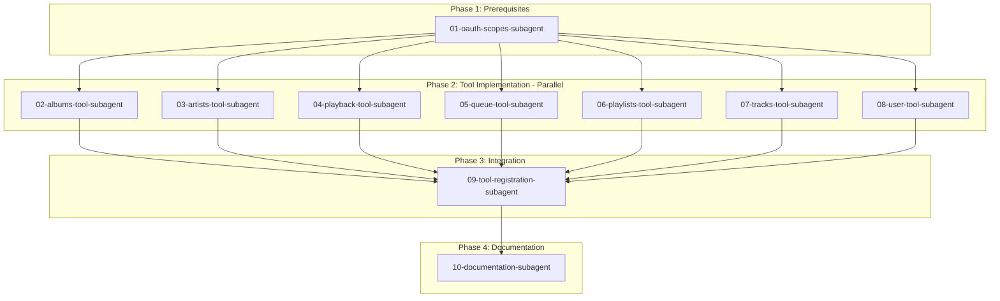

# Spotify API Sub-Agent Orchestration Plan

> **Created**: 2025-12-05
> **Total Sub-Agents**: 10
> **Total New Endpoints**: ~23

---

## 📋 Execution Overview



---

## 🚀 Execution Phases

### Phase 1: Prerequisites (Sequential)
| # | Sub-Agent | Description | Est. Time |
|---|-----------|-------------|-----------|
| 1 | [01-oauth-scopes-subagent](01-oauth-scopes-subagent.md) | Add new OAuth scopes | 5 min |

### Phase 2: Tool Implementation (Can Run in Parallel)
| # | Sub-Agent | Description | New Actions | Est. Time |
|---|-----------|-------------|-------------|-----------|
| 2 | [02-albums-tool-subagent](02-albums-tool-subagent.md) | Album operations | 4 | 15 min |
| 3 | [03-artists-tool-subagent](03-artists-tool-subagent.md) | Artist operations | 5 | 15 min |
| 4 | [04-playback-tool-subagent](04-playback-tool-subagent.md) | Playback control | 11 (6 migrated, 5 new) | 20 min |
| 5 | [05-queue-tool-subagent](05-queue-tool-subagent.md) | Queue management | 2 | 10 min |
| 6 | [06-playlists-tool-subagent](06-playlists-tool-subagent.md) | Playlist management | 8 (4 migrated, 4 new) | 20 min |
| 7 | [07-tracks-tool-subagent](07-tracks-tool-subagent.md) | Track operations | 6 | 15 min |
| 8 | [08-user-tool-subagent](08-user-tool-subagent.md) | User profile & following | 10 (3 migrated, 7 new) | 20 min |

### Phase 3: Integration (Sequential, After Phase 2)
| # | Sub-Agent | Description | Est. Time |
|---|-----------|-------------|-----------|
| 9 | [09-tool-registration-subagent](09-tool-registration-subagent.md) | Register all tools | 15 min |

### Phase 4: Documentation (Sequential, After Phase 3)
| # | Sub-Agent | Description | Est. Time |
|---|-----------|-------------|-----------|
| 10 | [10-documentation-subagent](10-documentation-subagent.md) | Update docs | 20 min |

---

## 📊 Summary Statistics

### Files Created
- 7 new tool files in `lib/ai/tools/spotify/`
- 1 index file `lib/ai/tools/spotify/index.ts`

### Files Modified
- `app/api/auth/spotify/route.ts` (OAuth scopes)
- `lib/services/spotify.ts` (service methods)
- `app/(chat)/api/chat/route.ts` (tool registration)
- `docs/SPOTIFY_INTEGRATION.md` (documentation)

### Files Deprecated/Removed
- `lib/ai/tools/spotify.ts` (legacy monolithic tool)

### New Endpoints by Category
| Category | New | Migrated | Total |
|----------|-----|----------|-------|
| Albums | 4 | 0 | 4 |
| Artists | 5 | 0 | 5 |
| Playback | 5 | 6 | 11 |
| Queue | 2 | 0 | 2 |
| Playlists | 4 | 4 | 8 |
| Tracks | 6 | 0 | 6 |
| User | 7 | 3 | 10 |
| **Total** | **33** | **13** | **46** |

### New OAuth Scopes
- `user-library-modify`
- `user-follow-read`
- `user-follow-modify`

---

## 🤖 Spawning Sub-Agents

To spawn each sub-agent, use the `new_task` tool with mode `code` and provide the following message format:

```
You are implementing a specific Spotify API integration task.

IMPORTANT: Read ALL of the following files FIRST before making any changes:
1. docs/subagents/00-master-blueprint.md - Conventions and patterns
2. docs/subagents/XX-specific-subagent.md - Your specific task

Follow the acceptance criteria exactly. Do not add extra functionality.
Do not modify files outside your task scope.
Report completion when all acceptance criteria are met.
```

### Example Spawn Command

For OAuth Scopes sub-agent:
```
new_task mode=code message="Implement OAuth scopes update. Read docs/subagents/00-master-blueprint.md and docs/subagents/01-oauth-scopes-subagent.md first. Follow acceptance criteria exactly."
```

---

## ✅ Pre-Execution Checklist

Before spawning sub-agents, verify:

- [ ] User has approved this plan
- [ ] All 11 sub-agent documents exist in `docs/subagents/`
- [ ] Master blueprint is complete
- [ ] Existing spotify.ts file structure is understood
- [ ] Existing spotify service methods are documented

---

## 🔄 Rollback Plan

If issues occur:

1. **Tool Registration Failed**: Revert `app/(chat)/api/chat/route.ts` to import old `spotify.ts`
2. **Service Methods Broken**: Keep backup of original `lib/services/spotify.ts`
3. **OAuth Flow Broken**: Revert scope changes in `app/api/auth/spotify/route.ts`

---

## 📝 Notes for Orchestrator

1. **Context Minimization**: Each sub-agent should only read:
   - The master blueprint
   - Their specific task document
   - The files they need to modify

2. **No Cross-Dependencies**: Sub-agents in Phase 2 don't depend on each other

3. **Verification Points**:
   - After Phase 1: OAuth flow still works
   - After Phase 2: TypeScript compiles
   - After Phase 3: Server starts without errors
   - After Phase 4: Documentation is accurate

4. **Conflict Avoidance**: 
   - All tool sub-agents modify `lib/services/spotify.ts` - add methods, don't modify existing
   - Only Tool Registration sub-agent modifies the chat route